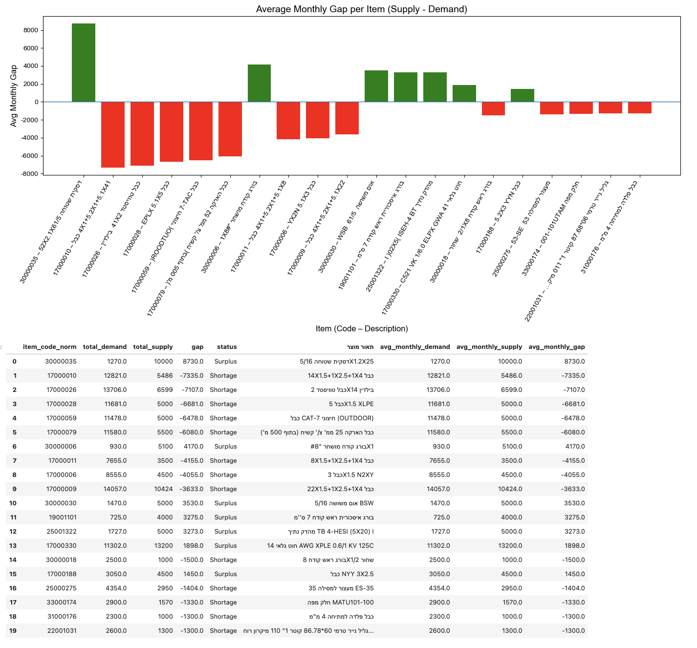
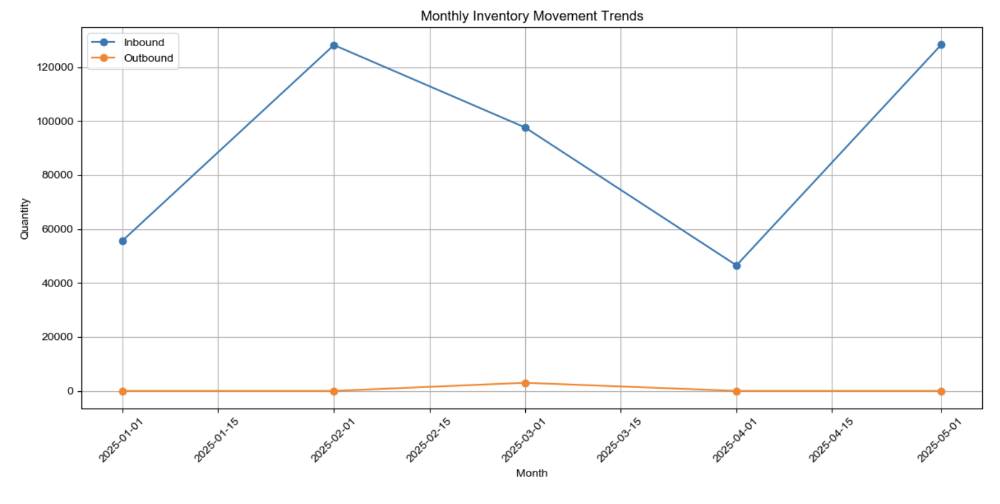
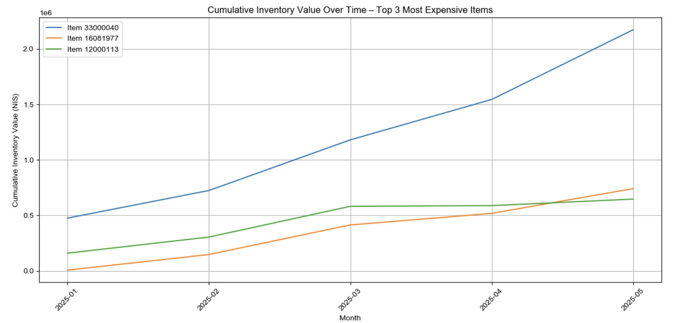
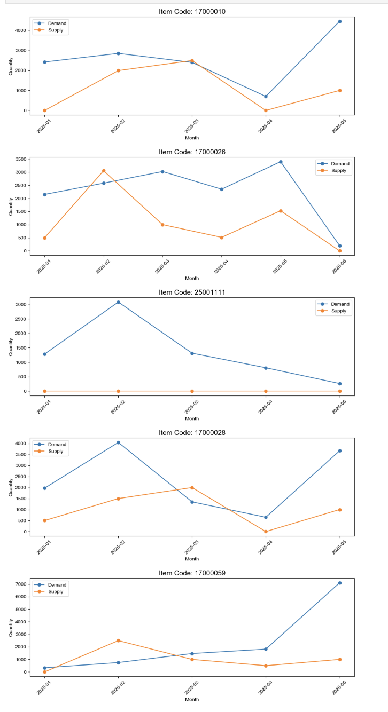
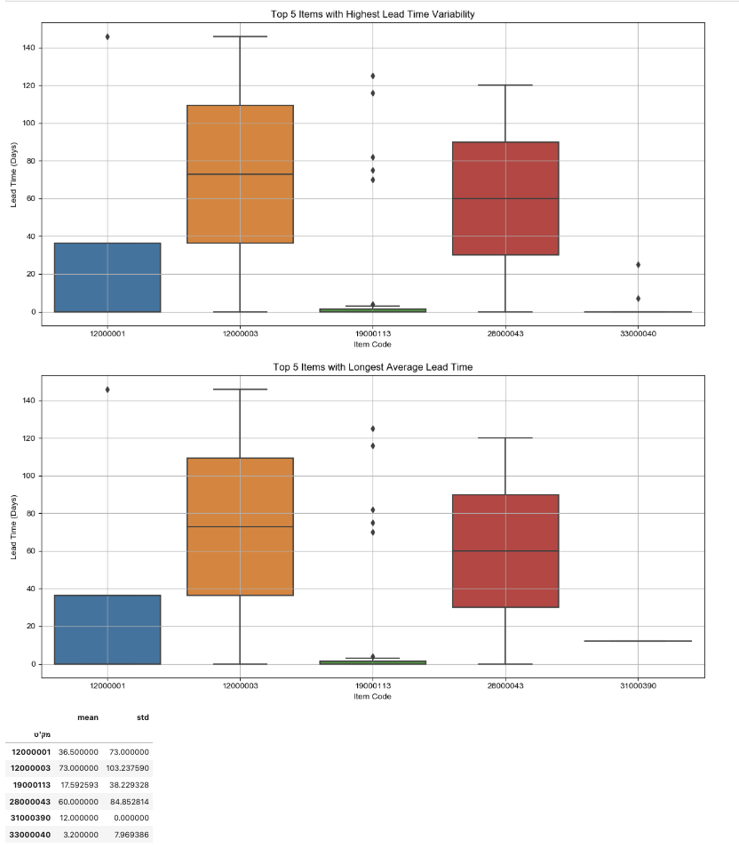
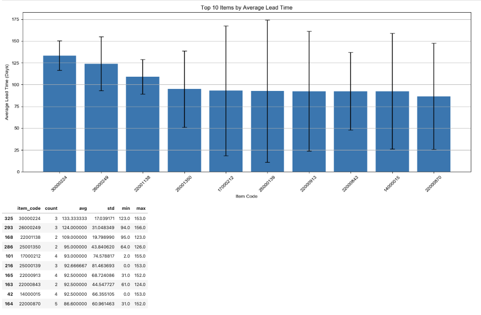
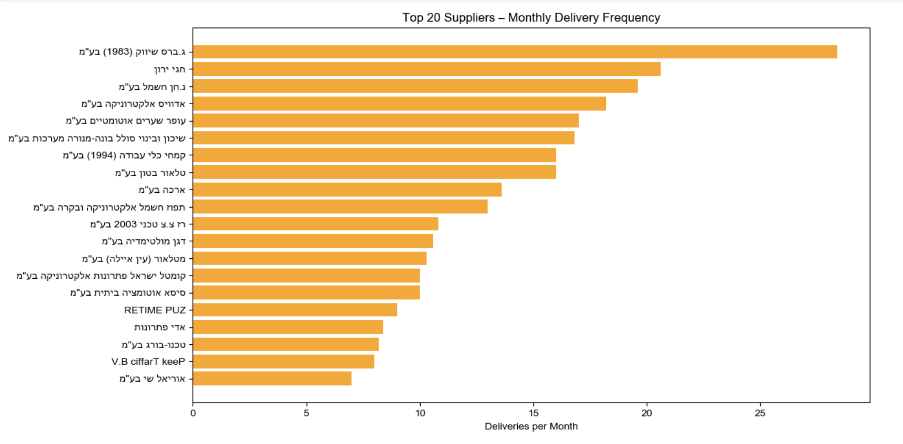
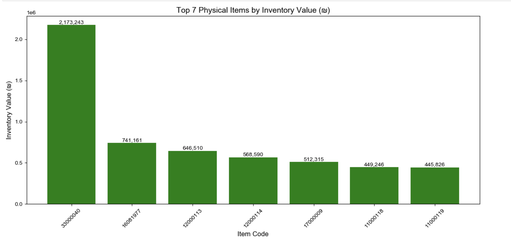

# 📦 YSB Inventory & Supply Chain Analysis

## Project Overview

This project analyzes inventory, demand, supply, and supplier behavior using operational data from YSB.

The goal of the analysis is to identify:

- Supply shortages and surpluses
- Demand vs supply gaps
- Inventory movement trends
- Lead time variability
- High-value inventory items
- Supplier delivery patterns

The analysis helps reveal operational inefficiencies and opportunities to improve inventory management and supply chain planning.

The project was implemented using:

- Python
- Pandas
- NumPy
- Matplotlib
- Seaborn
- Jupyter Notebook

---

# 📊 Average Monthly Supply vs Demand Gap

This visualization shows the average monthly gap between **supply and demand per item**.

Positive values indicate **surplus**, while negative values indicate **shortage**.

Key insights:

- Several items experience significant shortages where demand exceeds supply.
- Some items show strong surplus, indicating potential overstock.
- Identifying these items helps prioritize procurement and inventory balancing.

---

# 📦 Monthly Inventory Movement Trends

This chart tracks **inventory inflow (Inbound)** and **outflow (Outbound)** over time.

Observations:

- Inventory inflow varies significantly between months.
- Outbound movement is relatively smaller compared to inbound shipments.
- Peaks in inbound inventory may indicate major procurement cycles.

---

# 💰 Cumulative Inventory Value Over Time

This visualization tracks the cumulative inventory value of the **top three most expensive items**.

Insights:

- Certain items dominate the inventory value.
- Inventory value for these items steadily increases over time.
- Monitoring high-value inventory is essential for financial risk management.

---

# 📈 Demand vs Supply for Key Items

The following charts compare **monthly demand and supply** for several critical items.

Key observations:

- Some items consistently show demand exceeding supply.
- Certain months show large supply fluctuations.
- These patterns may indicate forecasting issues or procurement delays.

---

# ⏱ Lead Time Variability Analysis

This analysis focuses on items with the **highest lead time variability** and **longest average lead time**.

Insights:

- Some items show extremely high lead time variability.
- High variability makes inventory planning more difficult.
- These items may require safety stock adjustments.

---

# 🕒 Items with the Longest Average Lead Time

This chart highlights the **top 10 items with the longest average supplier lead time**.

Observations:

- Certain items require significantly longer delivery times.
- Long lead times increase the risk of stock shortages.
- These items require early procurement planning.

---

# 🚚 Supplier Delivery Frequency

This visualization shows the **top 20 suppliers by monthly delivery frequency**.

Key insights:

- Some suppliers provide frequent deliveries and may be considered reliable partners.
- Others appear less frequently and may represent specialized or infrequent suppliers.

---

# 💎 Top Physical Items by Inventory Value

This chart shows the **top 7 items with the highest inventory value**.

Observations:

- A small number of items represent a large portion of total inventory value.
- These items require careful monitoring due to their financial impact.

---

# 🔍 Key Insights

From the analysis we can conclude:

- Several items suffer from persistent supply shortages.
- Some inventory is overstocked, suggesting inefficient procurement.
- High lead time variability increases supply chain risk.
- A small number of items dominate total inventory value.
- Supplier behavior varies significantly in delivery frequency.

These insights can help improve:

- Demand forecasting
- Inventory planning
- Procurement strategies
- Supplier management

---

# 🛠 Technologies Used

- Python
- Pandas
- NumPy
- Matplotlib
- Seaborn
- Jupyter Notebook

---

# 📁 Repository Structure

